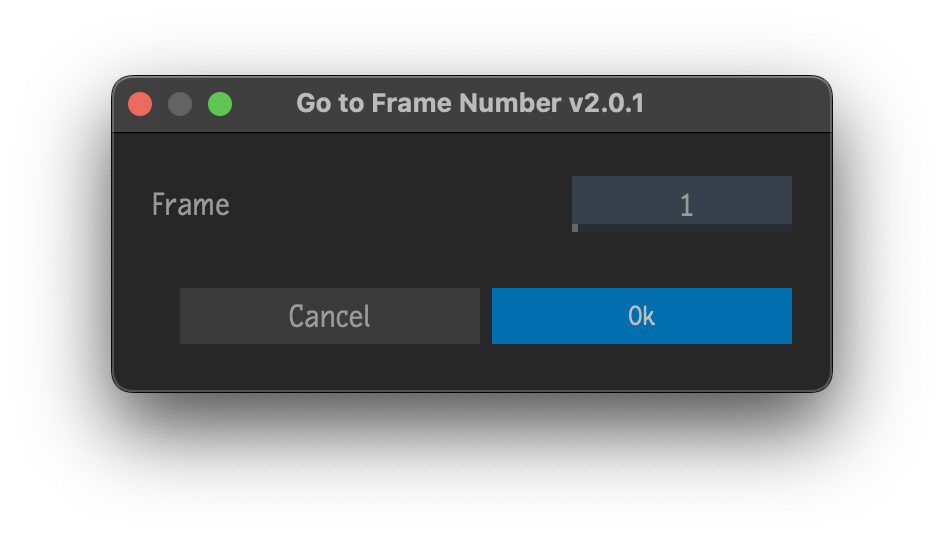

# Go To Frame Number
Plugin for [Autodesk Flame](http://www.autodesk.com/products/flame)

Move the positioner to specified frame for selected clips and/or sequences.

## Compatibility
|Script Version|Flame Version|
|---|---|
|v3.X.X|Flame 2025 and newer|
|v2.X.X|Flame 2022 up to 2024.2|
|v1.X.X|Flame 2021 up to 2021.2|

## Installation

### Flame 2025 and newer
To make available to all users on the workstation, copy `go_to_frame_number.py` to `/opt/Autodesk/shared/python/`

For specific users, copy `go_to_frame_number.py` to the appropriate path below...
|Platform|Path|
|---|---|
|Linux|`/home/<user_name>/flame/python/`|
|Mac|`/Users/<user_name>/Library/Preferences/Autodesk/flame/python/`|

### Flame 2021 up to 2024.2
To make available to all users on the workstation, copy `go_to_frame_number.py` to `/opt/Autodesk/shared/python/`

For specific users, copy `go_to_frame_number.py` to `/opt/Autodesk/user/<user name>/python/`

### Last Step
Finally, inside of Flame, go to Flame (fish) menu `->` Python `->` Rescan Python Hooks

## Menus
 - Right-click selected clips and/or sequences on the Desktop `->` Navigate... `->` Go to Frame Number
 - Right-click selected clips and/or sequences in the Media Panel `->` Navigate... `->` Go to Frame Number

## Acknowledgments
UI Templates courtesy of [pyflame.com](http://www.pyflame.com)
